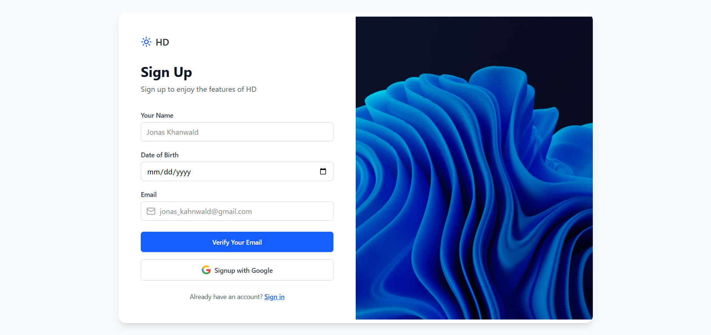
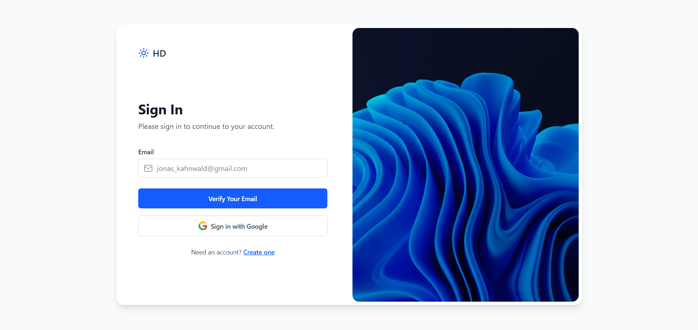
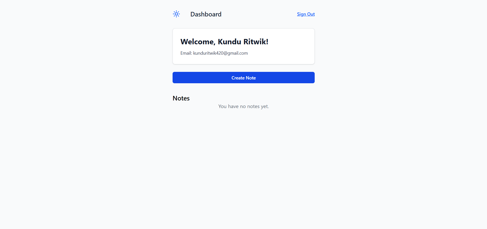
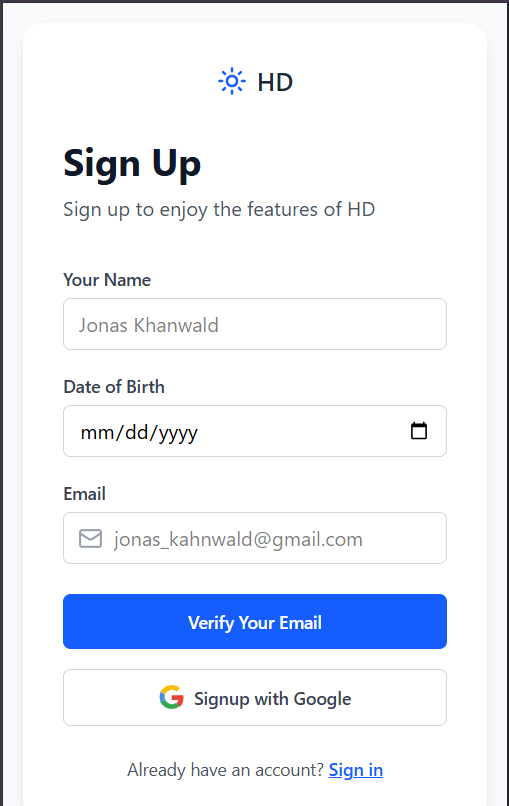

# 📘 HD Notes – MERN Authentication + Notes App

A **full-stack MERN application** that provides **secure authentication with OTP (Email-based)**, **Google OAuth integration**, and a **notes management system**.

Users can: 
- ✅ Sign up with email & OTP verification 
- ✅ Sign in with email or Google OAuth 
- ✅ Manage notes (create, view, update, delete) 
- ✅ Use a clean dashboard with React & TailwindCSS

## 🚀 Tech Stack

### **Frontend (Client)**
- ⚛️ React (Vite)
- 🎨 TailwindCSS
- 🔐 @react-oauth/google
- 🧰 Lucide Icons

### **Backend (Server)**
- 🟢 Node.js + Express.js
- 🍃 MongoDB with Mongoose
- 🔑 JWT Authentication
- 📧 Nodemailer (for OTP)
- 🌐 Google OAuth (via Google API)

## 📂 Folder Structure

### **Client (Frontend)**

```
client/
├── public/               # Static files
├── src/
│   ├── assets/           # Static assets (logos, images, svg)
│   ├── components/       # Reusable UI components
│   │   ├── AuthLayout.components.jsx
│   │   └── NoteItem.components.jsx
│   ├── context/          # Auth-related API calls & context
│   │   └── AuthContext.jsx
│   └── pages/            # Page components
│       ├── Authentication.page.jsx
│       ├── Dashboard.page.jsx
│       ├── NoteCreation.page.jsx
│       └── ViewNote.page.jsx
├── App.jsx               # Root app
├── index.css             # TailwindCSS styles
├── main.jsx              # React DOM entry point
├── .env                  # Environment variables
├── .gitignore            # Git ignore file
├── eslint.config.js      # ESLint configuration
├── index.html            # Main HTML file
├── package.json          # Dependencies
├── package-lock.json     # Lock file
├── README.md             # Project documentation
└── vite.config.js        # Vite configuration
```

### **Server (Backend)**

```
server/
├── src/
│   ├── controllers/      # Request handling
│   │   ├── authController.js
│   │   ├── noteController.js
│   │   └── OTP.controller.js
│   ├── database/         # DB connection
│   │   └── db.js
│   ├── middleware/       # Middlewares (auth)
│   │   └── auth.middleware.js
│   ├── models/           # Mongoose models
│   │   ├── noteModel.js
│   │   ├── OTP.model.js
│   │   └── userModel.js
│   ├── routes/           # API routes
│   │   ├── authRouter.js
│   │   ├── note.route.js
│   │   └── Otp.routes.js
│   └── utils/            # Utility files
│       ├── googleConfig.js
│       └── constant.js
├── .env                  # Environment variables
├── .gitignore            # Git ignore file
├── package.json          # Dependencies
├── package-lock.json     # Lock file
└── server.js             # Main Express app
```

## ⚙️ Installation & Setup

### 1️⃣ Clone the repo

```bash
git clone https://github.com/Ritwik2004/note-Assignment-highway-deloite-.git
cd note-Assignment-highway-deloite-
```

### 2️⃣ Setup **Server**

```bash
cd server
npm install
```

Create a `.env` file in `server/` with:

```env
PORT=5000
MONGO_URI=your_mongodb_connection_string
JWT_SECRET=your_jwt_secret_key
EMAIL_USER=your_email@example.com
EMAIL_PASS=your_email_password
GOOGLE_CLIENT_ID=your_google_client_id
GOOGLE_CLIENT_SECRET=your_google_client_secret
```

Run the server:

```bash
npm start
```

### 3️⃣ Setup **Client**

```bash
cd client
npm install
```

Create a `.env` file in `client/` with:

```env
VITE_GOOGLE_CLIENT_ID=your_google_client_id
VITE_API_URL=http://localhost:5000
```

Run the client:

```bash
npm run dev
```

## 🛠 Features

- 🔐 **Email OTP Authentication**
- 🧑‍🤝‍🧑 **Google OAuth Login**
- 📝 **Notes Management** (Create, Read, Delete, Update)
- 📊 **Dashboard** with user data
- 🎨 **Responsive UI** with TailwindCSS
- 🔒 **JWT-based Authentication**
- 📧 **Email OTP Verification**

## 🌱 Future Improvements

- Add password-based authentication as alternative
- Add profile picture support
- Improve note formatting (Markdown support)
- Dark mode toggle
- Search functionality for notes
- Categories/tags for notes
- Export notes feature

## 🔧 API Endpoints

### Authentication Routes
- `POST /api/auth/register` - Register user with email
- `POST /api/auth/verify-otp` - Verify OTP
- `POST /api/auth/login` - Login user
- `POST /api/auth/google` - Google OAuth login

### Notes Routes
- `GET /api/notes` - Get all user notes
- `POST /api/notes` - Create new note
- `GET /api/notes/:id` - Get specific note
- `PUT /api/notes/:id` - Update note
- `DELETE /api/notes/:id` - Delete note

## 📸 Screenshots







## 👨‍💻 Author

Developed by **Ritwik** 🚀

## 📜 License

This project is licensed under the MIT License.

## 🤝 Contributing

Contributions, issues, and feature requests are welcome! Feel free to check the [issues page](https://github.com/Ritwik2004/note-Assignment-highway-deloite-/issues).

## ⭐ Show your support

Give a ⭐️ if this project helped you!